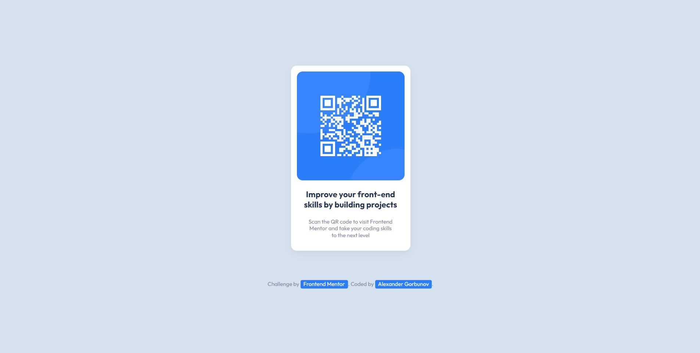

<h1 align="center">QR Code Component </h1>
<p align="center">
  Coded with <code>HTML</code>, <code>CSS</code>
</p>

<p align="center">
  
</p>

## ℹ️ About
  
  This is a solution to the [QR code component challenge on Frontend Mentor](https://www.frontendmentor.io/challenges/qr-code-component-iux_sIO_H).

* **Build out a QR code component**
  * `/design` - Folder with  designs. Contains both a mobile and a desktop version of the design. 
  * `/images` - Folder with assets. The assets are already optimized.
  * `style-guide.md` - File with the style information: color palette, fonts, etc.
* **Get it looking as close to the design as possible**. 
* **Use any tools to like**. You can use any tools you like to help you complete the challenge**. So if you've got something you'd like to practice, feel free to give it a go.

## ⚙️ Tools

* **HTML5**
  * Semantic HTML
* **CSS**
  * BEM naming convention
  * Flexbox
* **Github Pages** - for hosting

## 💡 Features

* **Animation on hover and click**. Click on the image, on buttons

## 📍 Additional information

### Filter on hover

```css
.card__image:hover {
  transform: scale(1.25);
  cursor: pointer;
  filter: hue-rotate(45deg);
}
```

### Make items undraggable

Discovered (via Google) a way to make items undraggable

```css
.card__image {
  -webkit-user-drag: none;
}
```

### Resize images without jumping out of frame

Finally found a way to resize images so they don't jump out of the frame

I placed the image in a container and set `overflow: hidden;` for the container

### Hue animation on hover

```css
.card__image:hover {
  transform: scale(1.25);
  cursor: pointer;
  filter: hue-rotate(45deg);
}

.card__image:active {
  transform: scale(1);
}
```

## 👤 Author

* Frontend Mentor - [@GrbnvAlex](https://www.frontendmentor.io/profile/GrbnvAlex)
* Telegram - [@Arlagonix](https://t.me/Arlagonix)
* Github - [@arlagonix](https://github.com/arlagonix)
